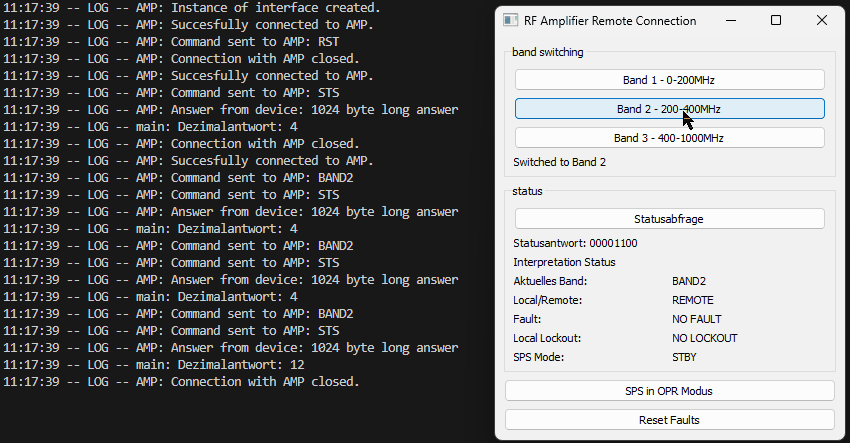

## Automating RF Amplifier System via GPIB

The idea of this project is to make use of the GPIB interface of an old RF amplifier system to write a simple python program that integrates into testing procedures in the working context.
The python program represents a proof of concept, the final goal is implementing the demonstrated functionality into existing testing software.

 

 
### Basic functionality of the program
The python program is supposed to be able to switch between frequency bands, display the current system status and if necessary reset any system faults. It uses the Qt library to display a GUI for user interaction.

### Using the program
A packaged version of the program (using the pyinstaller library) including all dependancies and an executable is included under the dist directory. The procedure for starting the program in the current working context looks 
like this:
1. Manually turn on both amplifier cabinets
2. Manually set the initial frequency band to 1 to avoid any invalid states
3. Open the executable and a terminal window and the GUI should launch, from there you should be able to use the program for all intended functionalities

### The RF Amplifier System
The Amplifier System consists of two separate assemblies (cabinets) and was installed in the late 80s to early 90s. It consists of three integrated amplifiers which in total can amplify in the
frequency range of 10kHz up to 1GHz. The amplifiers are split into frequency bands 10kHz-200MHz, 200MHz-400MHz, 400MHz-1GHz. The amplifier in the lowest band (SPS) makes up the whole right cabinet and uses vacuum 
tubes to produce its rated power output of 1kW. The other two solid-state amplifiers are located directly under the switching matrix (SIM) on the left cabinet and each have a power output of 500W. 
Here is how the amplifier system reacts to the program, the left gif displays the remote band switching while the right one is the tube amplifier switching between standby and operating modes.

  
   

### Communicating with the Amplifier System
The NI-488.2 and VISA drivers by National Instruments form the basis of the communication with the system. A first test was done by simply connecting the SIM to the computer via a GPIB to USB adapter and then trying to
talk to the system via the NI MAX (Measurement & Automation Explorer) software also provided by NI. This was a success, yet the answers the system seemed to give were intially difficult to interpret.   
The following image depicts all components of the amplifier system detected after an instrument scan of the connected GPIB interface.

The binary address switches at the back of each component were double-checked to ensure a successful connection. Here is a list of all available commands for communicating with the system as defined by the manufacturer that
were used in this project:

| Command  | Instrument  | Description  |
|---|---|---|
| STS  | SIM/system  | Returns the current status of the system as a status byte with a documented bit definition.  |
| BAND<X>  | SIM/system  | Switches the system (SIM) to the specified frequency band.  |
| RST  | SIM/system  | Resets any latched faults within the system.  |
| STBY/OPER  | Tube Amp (SPS)  | Sets the tube amplifier to standby/operating mode.  |
| STAT  | Tube Amp (SPS)  | Returns the current status of the tube amplifier.  |

### Known Bugs and potential future improvements
Bugs (07.02.2024):
- Sending two status queries in succession whilst in frequency band 1 leads to a VISA timeout. This exception has been caught in the current version but the cause not yet identified.

Improvements (07.02.2024):
- VISA resource addresses are currently hardcoded. Add functionality to either manually select instruments or automatically select instrument address depending on working environment.
- Implement a logical check and visual feedback that the operate mode on the SPS is succesfully set. The status query of the SPS remains hard to interpret.
- Overall efficiency of the program by rebalancing delays and succesful communication with system.
